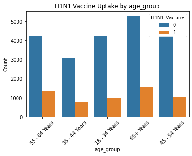
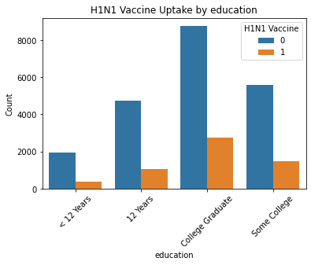
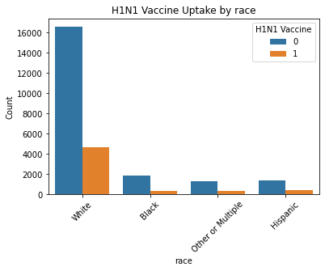
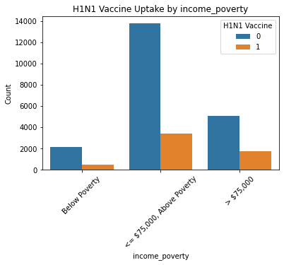
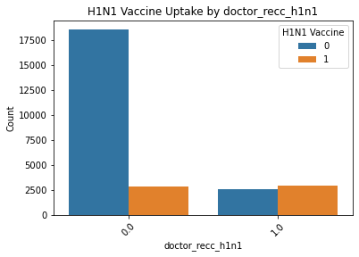
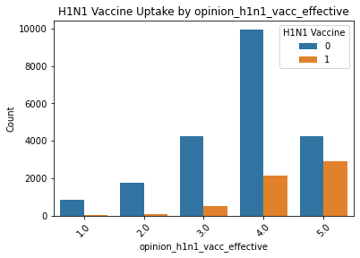
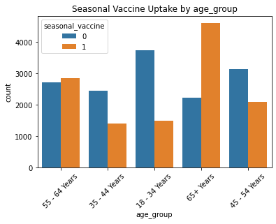
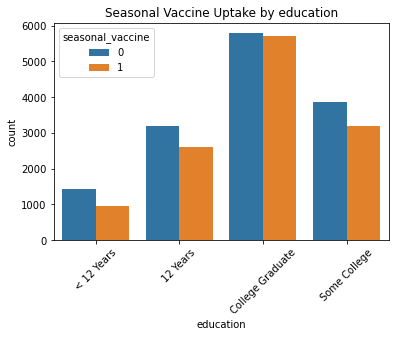
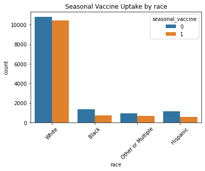
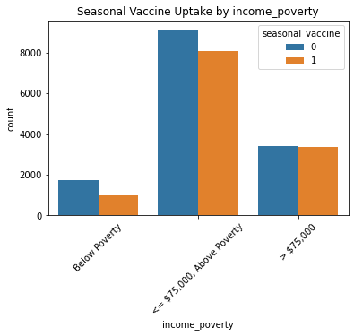

# PROJECT TITLE: PREDIDCTING VACCINE UPTAKE FOR TARGETED PUBLIC HEALTH INTERVENTIONS

# PROJECT OVERVIEW

This project, focuses on predicting vaccination uptake for H1N1 and seasonal flu vaccines using a dataset of individual characteristics and behaviors. The primary goal is to identify unvaccinated individuals (class 0) with high recall to enable targeted public health interventions. The notebook encompasses data preprocessing, exploratory data analysis, baseline model training, evaluation, and hyperparameter tuning for Random Forest and Gradient Boosting models to optimize performance for unvaccinated individuals.

# BUSINESS UNDERSTANDING

Vaccination is a critical public health strategy for preventing infectious diseases like H1N1 and seasonal influenza. However, vaccine hesitancy and low uptake rates can undermine herd immunity, leading to outbreaks. Public health organizations need tools to identify individuals unlikely to get vaccinated to deliver targeted outreach, education, and resources. This project leverages machine learning to predict vaccination status, prioritizing high recall for unvaccinated individuals to ensure effective intervention strategies, ultimately reducing disease spread and improving community health outcomes.

# PROBLEM STATEMENT

# OBJECTIVES

1. To provide actionable insights to public health organizations to inform strategies for increasing vaccine uptake and reducing disease spread.
2. To identify vulnerable groups (e.g., uninsured, low-income, low-health-literacy) that may need additional support or information to access vaccines.

3. To help public health organizations craft more personalized, effective education campaigns to combat vaccine hesitancy and misinformation.

4. To analyze individual behaviors, health beliefs, and demographic factors to determine how they influence vaccine decision-making in real populations.

# DATA UNDERSTANDING

The dataset, sourced from data/training_set_features.csv and data/training_set_labels.csv, is merged into cleaned_vaccine_data.csv after preprocessing. Key details:

Rows: 26,707 individuals

Features: 32 after preprocessing (originally 38)

Numerical: 22 columns (e.g., h1n1_concern, h1n1_knowledge, household_adults)

Categorical: 9 columns (e.g., age_group, health_insurance, education)

Dropped Columns: employment_industry, employment_occupation (high missing values >50%), hhs_geo_region, census_msa (low relevance)

Target Variables: Two binary labels (h1n1_vaccine, seasonal_vaccine)

H1N1: ~78.7% unvaccinated (6,311 in validation), ~21.3% vaccinated (1,702)

Seasonal: ~53.4% unvaccinated (4,282 in validation), ~46.6% vaccinated (3,731)

Missing Values: Handled by filling numerical columns with median, categorical columns with mode, and health_insurance with 'NA' (45.96% missing).

Train-Test Split: 70% training (18,694 samples), 30% validation (8,013 samples), stratified by both labels.

# ANALYSIS

1. 

2. 

3. 

4. 

5. 

6. 

7. 

8. 

9. 

10. 

11. 

# FEATURE ENGINEERING

Feature engineering steps include:

Dropping Columns: Removed employment_industry, employment_occupation (>50% missing), hhs_geo_region, census_msa (low predictive value).

Handling Missing Values:

Numerical: Filled with median (e.g., h1n1_concern, household_adults).

Categorical: Filled with mode (e.g., education, income_poverty).

health_insurance: Filled with 'NA' to preserve information.

Encoding: Categorical features (e.g., age_group, sex) encoded using OneHotEncoder with drop='first' to avoid multicollinearity, applied within a ColumnTransformer for pipeline integration.

Output: Saved preprocessed dataset as cleaned_vaccine_data.csv for consistent use.

# MODELLING

The notebook implements multi-label classification using MultiOutputClassifier for two labels (h1n1_vaccine, seasonal_vaccine). Key modeling steps:

Baseline Models:

Logistic Regression: Recall 0.95/0.81 (H1N1/seasonal unvaccinated), F1 0.91/0.79.

Decision Tree: Recall 0.84/0.70, F1 0.85/0.70 (underperformed).

Random Forest: Recall 0.96/0.81, F1 0.91/0.79 (strong performance).

Gradient Boosting: Recall 0.95/0.82, F1 0.91/0.80 (comparable to Random Forest).

Evaluation Metrics: Focused on recall for unvaccinated (class 0) and F1-score, using classification_report via the Evaluator class.

Hyperparameter Tuning (incomplete in notebook, corrected in hyperparameter_tuning.ipynb):

Random Forest: Tuned n_estimators, max_depth, min_samples_split, min_samples_leaf, class_weight using GridSearchCV with a custom recall scorer for unvaccinated individuals.

Gradient Boosting: Tuned n_estimators, learning_rate, max_depth, min_samples_split, class_weight.

Error Note: Later cells incorrectly split y_train into y_train_h1n1 and y_train_seasonal, causing a ValueError in multi-output context. Corrected by maintaining y_train as a 2D DataFrame.

Tuned Results (from provided output):

Random Forest (H1N1): Best parameters {max_depth: None, max_features: 'sqrt', min_samples_leaf: 1, min_samples_split: 5, n_estimators: 200}, F1-macro 0.73, recall 0.96 (unvaccinated).

Gradient Boosting (Seasonal): Best parameters {learning_rate: 0.1, max_depth: 3, min_samples_split: 2, n_estimators: 200, subsample: 1.0}, F1-macro 0.78.

# DEPLOYMENT

# CONCLUSION

The project successfully developed predictive models for H1N1 and seasonal flu vaccine uptake, with Random Forest and Gradient Boosting achieving high recall (0.96/0.81 and 0.95/0.82, respectively) for unvaccinated individuals. These models meet the goal of identifying individuals for targeted interventions. Hyperparameter tuning improved performance, though challenges with class imbalance and vaccinated individual recall persist. The preprocessing pipeline effectively handled missing data and categorical encoding, ensuring robust model training.